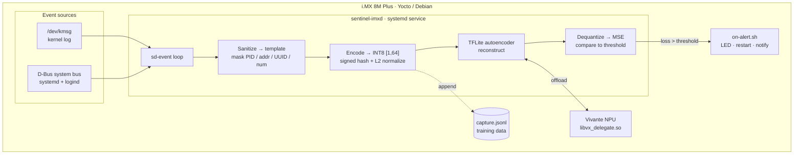
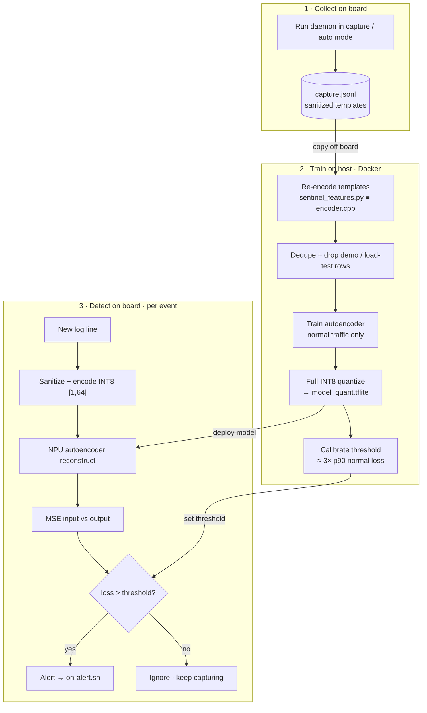

# sentinel-imx-sys

A lightweight log-anomaly detection daemon for the **NXP i.MX 8M Plus** (Yocto /
Debian), plus a self-contained Docker build + model-training environment.

The daemon (`sentinel-imxd`) listens to kernel messages (`/dev/kmsg`) and D-Bus
system-bus signals, sanitizes each line into a stable *template*, encodes it into
a fixed **INT8 `[1, 64]`** vector, optionally runs a TensorFlow Lite autoencoder
on the **Vivante NPU** via the VX external delegate, and — when the reconstruction
loss (MSE) exceeds a threshold — runs an external alert script.

## Architecture

### System architecture

Everything runs **on the device**. Kernel and D-Bus events flow through a single
`sd-event` loop, get turned into a normalized INT8 feature vector, and are scored
by a TensorFlow Lite autoencoder that is offloaded to the Vivante NPU. A high
reconstruction error triggers a user-supplied action script.



### Training & detection workflow

The daemon captures normal traffic; you train a model from it on the host (in the
Docker environment) using the **same encoder** the daemon runs, then deploy the
model and its calibrated threshold back to the board. Detection is a per-event
reconstruction-error check against that threshold.



## What it does, in plain terms

Embedded Linux boxes are noisy: the kernel and system services emit a constant
stream of log lines. Most are routine; a few (a failing eMMC, an OOM kill, a USB
device misbehaving, an unexpected service crash) are early warnings. Watching
those by hand doesn't scale, and shipping every log to the cloud is often
impossible or undesirable on an edge device.

`sentinel-imx-sys` learns what *normal* logs look like for **your** device, then
flags the abnormal ones **on the device**, in real time, at near-zero cost — and
runs a script of your choosing when something looks wrong. No cloud, no log
shipping, data stays local.

It's an **autoencoder for logs**: it's trained only on normal traffic, so when it
sees something unfamiliar it reconstructs it poorly (high error = anomaly).

Each event is reduced to a template (PIDs/addresses/UUIDs/numbers masked), hashed
into a 64-bin signed histogram, and **L2-normalized** before it hits the model.
That normalization matters: without it the reconstruction error just tracks how
*many* tokens a line has, so the model ranks events by length and a short kernel
`BUG:` line looks more "normal" than routine chatter. Projecting every event onto
the unit sphere makes the score reflect the token *pattern* — novelty, not size.

## Design highlights

- **Capture-first.** With no model present (`mode=auto`), the daemon just records
  sanitized/encoded events to a JSONL file — use it to collect training data on
  the real board, then train and drop in `model_quant.tflite`.
- **Actions are yours.** Alerts don't do anything hard-coded; they exec a
  configurable bash script with rich context in the environment.
- **Minimal dependencies.** Only `libsystemd` (sd-event + sd-bus) and TensorFlow
  Lite. No Boost, no JSON library (JSON is written/parsed by hand).
- **NPU acceleration.** Uses `/usr/lib/libvx_delegate.so` as a TFLite *external
  delegate*; `USE_GPU_INFERENCE=0` steers it to the NPU rather than the 3D GPU.

## Repository layout

```
CMakeLists.txt            Cross/native build
docker-compose.yml        One-command dev environment
docker/                   SDK download + cross-build + training image
config/sentinel-imx.conf  Runtime configuration
systemd/                  Service unit
scripts/on-alert.sh       Alert hook stub (customize this)
scripts/sentinel-tui.py   Neon '80s dashboard for demos (run on the board)
scripts/demo.sh           One-screen tmux live demo (run on the board)
scripts/npu-bench.sh      CPU-vs-NPU latency benchmark (run on the board)
scripts/npu-load.py       NPU load generator (drives the load meter for demos)
tools/                    Host-side training + capture export (+ diag_loss.py)
tools/sentinel_features.py  Python mirror of the C++ sanitize+encode pipeline
src/                      Daemon sources
LICENSE / NOTICE          Apache-2.0
```

## Build (self-contained, via Docker)

NXP's public EVK downloads are flashable `.wic` images, not an application SDK.
The container instead installs the public **standard Scarthgap (Yocto 5.0 LTS)
aarch64 SDK** — the same Yocto series as NXP LF 6.6.52 — giving the cross
toolchain in the familiar board-SDK layout. (The *standard* toolchain is used
rather than the extensible `-ext-` one, which refuses to install as root.)
TensorFlow Lite is fetched from the NXP git fork at configure time;
`libvx_delegate.so` lives on the target at runtime.

```bash
# 1. Build the image (downloads the SDK + libsystemd, installs TF for training)
docker compose build

# 2. Cross-compile the daemon -> ./out/sentinel-imxd (aarch64)
docker compose run --rm dev ./docker/scripts/build.sh

# 3. Train a model from captured data -> ./out/model_quant.tflite
docker compose run --rm dev ./docker/scripts/train.sh data/capture.jsonl

# ...or, with no capture file, train on synthetic data (placeholder model):
docker compose run --rm dev ./docker/scripts/train.sh
```

> Build outputs land in `./out/` owned by root (the container runs as root). Run
> `sudo chown -R "$USER:$USER" out build-aarch64` if you need to edit them from
> the host.

If you have a real NXP SDK installer, drop it in `docker/sdk/*.sh`; it takes
precedence over the public poky toolchain (and already contains `libtensorflow-lite`
and the i.MX tuning).

To skip the heavy TensorFlow Lite build (capture-only daemon):

```bash
docker compose run --rm dev ./docker/scripts/build.sh -DSENTINEL_ENABLE_TFLITE=OFF
```

### Native build on the board

On an i.MX image that already ships `libsystemd` and `libtensorflow-lite`:

```bash
cmake -S . -B build -DSENTINEL_ENABLE_TFLITE=ON
cmake --build build -j
sudo cmake --install build
```

## Deploy

```bash
# Copy the cross-built binary + assets to the board, then:
sudo install -m0755 out/sentinel-imxd /usr/bin/sentinel-imxd
sudo install -Dm0644 config/sentinel-imx.conf /etc/sentinel-imx/sentinel-imx.conf
sudo install -Dm0644 systemd/sentinel-imx.service /usr/lib/systemd/system/sentinel-imx.service
sudo install -Dm0755 scripts/on-alert.sh /usr/libexec/sentinel-imx/on-alert.sh
sudo install -Dm0644 out/model_quant.tflite /usr/share/sentinel-imx/model_quant.tflite   # optional
sudo systemctl daemon-reload
sudo systemctl enable --now sentinel-imx.service
```

## Configuration

See [`config/sentinel-imx.conf`](config/sentinel-imx.conf). Every key can be
overridden by a `SENTINEL_<KEY>` environment variable. Key options:

| Key                  | Default                                       | Meaning                                   |
|----------------------|-----------------------------------------------|-------------------------------------------|
| `mode`               | `auto`                                         | `auto` / `capture` / `infer`              |
| `model_path`         | `/usr/share/sentinel-imx/model_quant.tflite`   | TFLite autoencoder                        |
| `delegate_path`      | `/usr/lib/libvx_delegate.so`                   | Vivante VX external delegate              |
| `threshold`          | `45`                                           | MSE anomaly threshold (model-specific; the trainer suggests one in `out/threshold.txt`) |
| `alert_script`       | `/usr/libexec/sentinel-imx/on-alert.sh`        | Program run on anomaly                    |
| `alert_cooldown_sec` | `10`                                           | Min seconds between alerts                |
| `capture_path`       | `/var/lib/sentinel-imx/capture.jsonl`          | JSONL training data                       |
| `kmsg` / `dbus`      | `true` / `true`                                | Enable event sources                      |
| `dbus_match`         | (built-in defaults)                            | Repeatable D-Bus match rule               |

### Alert script environment

`on-alert.sh` receives: `SENTINEL_LOSS`, `SENTINEL_THRESHOLD`, `SENTINEL_SOURCE`
(`kmsg`/`dbus`), `SENTINEL_TEMPLATE`, `SENTINEL_RAW` (truncated).

## Live demo (on the board)

### Option A — neon dashboard (best for recording)

`scripts/sentinel-tui.py` is a dependency-free ('80s synthwave) full-screen
dashboard: animated banner, per-core CPU bars + sparklines, Vivante GPU/NPU
load, memory/temp/uptime, the daemon's live vitals, and a colorized live event
stream. Keys on camera:

- `a` / `space` — inject a synthetic anomaly (watch the alert fire in the stream)
- `n` — toggle **NPU stress**: loops the large showcase model on the NPU so the
  accelerator meter (`core c1`) climbs to ~40–80% while the GPU (`core c0`) stays
  flat — a live, honest proof that the work lands on the NPU. Copy the showcase
  model + load generator to the board first (see below).
- `q` — quit

```bash
# copy the dashboard, load generator, and showcase model once:
scp scripts/sentinel-tui.py scripts/npu-load.py root@<board>:/usr/local/bin/
scp out/model_showcase.tflite root@<board>:/usr/share/sentinel-imx/
# then run over an SSH TTY so keys work:
ssh -t root@<board> 'python3 /usr/local/bin/sentinel-tui.py'
```

### Option B — tmux four-pane split

`scripts/demo.sh` splits your terminal into a single screen that tells the whole
story — run it on the board (needs `tmux`):

```bash
./demo.sh
```

- **top-left** — live detections (`journalctl -u sentinel-imx -f`)
- **top-right** — NPU proof: the daemon is a registered client of the Vivante
  NPU driver and its model tensors are resident in NPU video memory
- **bottom-left** — `top` filtered to the daemon (CPU stays tiny)
- **bottom-right** — a pre-typed fault injector; press Enter to fire one:

```bash
echo "kernel BUG: unable to handle kernel paging request at 00000000" > /dev/kmsg
```

The narrative: inject a scary kernel message → an alert fires instantly → CPU
barely moves → because the model is running through the NPU delegate.

### Proving the NPU is engaged

The i.MX NPU load gauge (`/sys/kernel/debug/gc/load`) stays near 0% for the
*production* workload — a tiny INT8 autoencoder finishes each inference almost
instantly (even ~6000 inferences/sec only registers ~3%), so there are no
sustained "busy cycles" to show. That's the efficiency story, not a bug. Two
ways to prove the NPU is really doing the work:

**Live (visual).** Press `n` in the dashboard, or run the load generator
directly. It loops the large showcase model on the NPU and the meter climbs to
~40–80% on `core c1` (the NPU) while `core c0` (the 3D GPU) stays at 0%:

```bash
USE_GPU_INFERENCE=0 python3 scripts/npu-load.py \
    /usr/share/sentinel-imx/model_showcase.tflite
watch -n1 cat /sys/kernel/debug/gc/load     # core 1 (NPU) rises; core 0 stays 0
```

**Static (binding + residency).** Regardless of load:

```bash
# 1. The daemon is bound to the Vivante NPU/GPU driver:
cat /sys/kernel/debug/gc/clients            # -> lists sentinel-imxd

# 2. Its model tensors are resident in NPU (VIP) video memory:
grep -A5 sentinel-imxd /sys/kernel/debug/gc/database

# 3. The journal shows the graph was delegated:
journalctl -u sentinel-imx | grep -i delegate
#   -> using external delegate /usr/lib/libvx_delegate.so (NPU)
```

## Performance: CPU vs NPU (measured on i.MX 8M Plus)

Measured with NXP's `benchmark_model` (INT8), and via the running daemon:

| Metric | Value |
|---|---|
| Daemon idle CPU | ~0.3% |
| End-to-end CPU per event (parse → encode → infer → capture) | ~0.25 ms |
| Resident memory (RSS) | ~37 MB |
| Production model (4.1K MACs) — **CPU** (1× A53) | **~2.3 µs / inference** |
| Production model (4.1K MACs) — NPU (VX delegate) | ~110 µs / inference |
| Showcase model (8.8M MACs) — CPU (4 threads) | ~1130 µs / inference |
| Showcase model (8.8M MACs) — NPU (VX delegate) | ~1180 µs / inference (+3.35 s first-run compile) |

**Honest takeaway:** for this workload the **CPU is the right choice**. The i.MX
NPU (VIP8000) is built for large convolutional/vision tensors; small INT8
MLP/autoencoder inferences are dominated by per-invoke dispatch and weight-DMA
overhead, so the NPU is far slower for the tiny production model and only
break-even for a deliberately heavy one. The daemon supports the NPU delegate
(and it works — the graph is fully delegated) so you can drop in a heavier model
later, but out of the box the anomaly signal simply doesn't need it, which is
*why the daemon is so cheap to run*.

Reproduce the comparison on your board:

```bash
# tiny production model (CPU wins big)
./npu-bench.sh /usr/share/sentinel-imx/model_quant.tflite

# heavy showcase model (train it first: train.sh --arch large)
./npu-bench.sh /tmp/model_showcase.tflite
```

## Training your own model

1. Run in `capture` (or `auto` without a model) to collect `capture.jsonl`.
2. Copy it off the board into `./data/capture.jsonl`.
3. `docker compose run --rm dev ./docker/scripts/train.sh data/capture.jsonl`.
4. Copy `out/model_quant.tflite` to the board, set `threshold` from
   `out/threshold.txt` in the config, and restart the service.

The model is a small autoencoder (`64 -> 32 -> 64`, INT8 in/out). Training
**re-encodes the captured templates** with the exact same normalized encoder the
daemon uses (`tools/sentinel_features.py` mirrors `src/encoder.cpp`), so training
matches inference byte-for-byte. Two details make the scores meaningful:

- **Deduplication** (`--dedupe`, on by default in `train.sh`): each distinct
  normal template is learned once, so a handful of very frequent patterns (e.g.
  session churn) can't dominate and leave rare-but-normal messages under-learned.
- **Excludes synthetic/demo traffic**: templates containing `demo-inject`,
  `npuload`, or `loadtest` are dropped, so the model never learns the very
  anomalies you inject (or the benchmark load generators) as "normal".

After export the trainer runs the quantized model over the normal set, prints the
loss distribution, and writes a suggested `threshold` (~3x the p90 steady-state
floor) to `out/threshold.txt`. `tools/diag_loss.py` prints normal-vs-anomaly
losses if you want to eyeball the separation before deploying.

Training runs under the Keras 2 API (`tf-keras`, selected via
`TF_USE_LEGACY_KERAS=1`): TensorFlow 2.16 defaults to Keras 3, whose graph the
full-int8 TFLite quantizer cannot lower. The dev image installs `tf-keras` and
the training script sets the flag automatically — no action needed.

Pass `--arch large` for a deliberately heavy (~8.8M MAC) autoencoder with the
same INT8 `[1,64]` interface — useful only for the NPU-vs-CPU benchmark, not for
production:

```bash
docker compose run --rm dev ./docker/scripts/train.sh   # small (default)
docker compose run --rm --entrypoint bash dev -lc \
  'python3 tools/train_autoencoder.py --synthetic --arch large --output out/model_showcase.tflite'
```

### Capture file format

One JSON object per line:

```json
{"ts":1725270000,"source":"kmsg","template":"usb <NUM>-<NUM> new high-speed usb device number <NUM> using <HEX>","vector":[3,-1,0, ...]}
```

`tools/export_capture.py` converts this to a NumPy `(N, 64)` int8 array.

### Log rotation

The daemon appends forever. Add a `logrotate` snippet if needed:

```
/var/lib/sentinel-imx/capture.jsonl {
    weekly
    rotate 4
    missingok
    notifempty
    copytruncate
}
```

## License

Apache-2.0 — see [`LICENSE`](LICENSE) and [`NOTICE`](NOTICE). Contributions
welcome; see [`CONTRIBUTING.md`](CONTRIBUTING.md).

TensorFlow Lite (NXP fork) is fetched at build time and the Vivante VX delegate
lives on the target device; neither is redistributed here.
